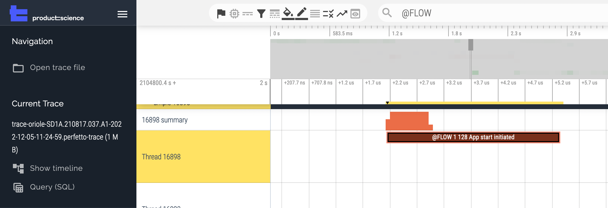

# Essentials Steps

To get unique insights to your code with our PS Tool, follow the step by step below:
_________________

## Instrumentation
Instrument and build the app with our plugin, so it can analyze your code.
_________________

## How to Instrument

### Android/Gradle

**1. Credentials**
Product Science shared access credentials (`productscience.properties` file) via Bitwarden sent. 
Please place it in the root directory of your project.

The Product Science Android plugin is distributed as a public GitHub maven package. 
It's publicly available but requires authentication with any github account.

Please [generate new token](https://github.com/settings/tokens/new) with **read:packages** access and setup `gradle.properties` in your home directory `~/.gradle/gradle.properties`.

```bash
github_user=<Github Account>
github_key=<Github Token>
```

**2. Add Product Science maven repository**

In `build.gradle` add the maven build info to the repositories for project and subprojects:

```groovy title="groovy build.gradle"
    buildscript {
        repositories {
            maven {
                url "https://maven.pkg.github.com/product-science/PSAndroid"
                credentials {
                    username = github_user
                    password = github_key
                }
            }
        }
        dependencies { ... }
    }
    
    allprojects {
        repositories {
            maven {
                url "https://maven.pkg.github.com/product-science/PSAndroid"
                credentials {
                    username = github_user
                    password = github_key
                }
            }
        }
    }
```

```kotlin title="kotlin build.gradle.kts"
    buildscript {
        repositories {
            maven {
                url = uri("https://maven.pkg.github.com/product-science/PSAndroid")
                credentials {
                    username = System.getProperty("github_user")
                    password = System.getProperty("github_key")
                }
            }
        }
        dependencies { ... }
    }

    allprojects {
        repositories {
            maven {
                url = uri("https://maven.pkg.github.com/product-science/PSAndroid")
                credentials {
                    username = System.getProperty("github_user")
                    password = System.getProperty("github_key")
                }
            }
        }
    }

```

If the project is configured to prefer settings repositories maven source should be added to settings file:

```groovy title="groovy settings.gradle"
    ...
    dependencyResolutionManagement {
        repositoriesMode.set(RepositoriesMode.FAIL_ON_PROJECT_REPOS)
        repositories {
            maven {
                url "https://maven.pkg.github.com/product-science/PSAndroid"
                credentials {
                    username = github_user
                    password = github_key
                }
            }
        }
    }
```

```kotlin title="kotlin settings.gradle.kts"
    ...
    dependencyResolutionManagement {
        repositoriesMode.set(RepositoriesMode.FAIL_ON_PROJECT_REPOS)
        repositories {
            maven {
                url = uri("https://maven.pkg.github.com/product-science/PSAndroid")
                credentials {
                    username = System.getProperty("github_user")
                    password = System.getProperty("github_key")
                }
            }
        }
    }
```


In another case, if `allprojects` is not present in top level `build.gradle` then add it in the top of the file.  

**3. Add Product Science plugin to `classpath`**


```groovy title="groovy build.gradle"
    buildscript {
        repositories { ... }
        dependencies {
            classpath "com.productscience.transformer:transformer-plugin:{{ android_release() }}"
            classpath "com.productscience.transformer:transformer-instrumentation:{{ android_release() }}"
        }
    }
    ...
```

```kotlin title="kotlin build.gradle.kts"
    buildscript {
        repositories { ... }
        dependencies {
            classpath("com.productscience.transformer:transformer-plugin:{{ android_release() }}")
            classpath("com.productscience.transformer:transformer-instrumentation:{{ android_release() }}")
        }
    }
    ...
```

**Please label your build with the PSi Plugin Version from above i.e.**  `MyAppPSi0.9.1.apk` **so our AI can learn how its dynamic instrumentation is performing on the build.**

**4. Apply the Product Science Plugin**

Apply plugin to `app/build.gradle`  

```groovy title="groovy app/build.gradle"
    plugins {
        id "com.android.application"
        id "kotlin-android"
    }
    apply plugin: "com.productscience.transformer.plugin"
    ...
```

```kotlin title="kotlin app/build.gradle.kts"
    plugins {
        id("com.android.application")
        id("kotlin-android")
        id("com.productscience.transformer.plugin")
    }
    ...
```

**5. Add Proguard rules**

If the application uses obfuscation/shrinking add a new ProGuard rule to your project.
To achieve it add the next line to the R8/ProGuard configuration file: 
  
```proguard title="proguard-rules.pro."
-keep class com.productscience.transformer.module.** { *; }
```

Your project may use the other proguard file name.

More information about R8/ProGuard configuration can be found here:
[https://developer.android.com/studio/build/shrink-code](https://developer.android.com/studio/build/shrink-code)

**6. Build your app**
Now you can build your app with Gradle, i.e.:
```bash
./gradlew assemble
```

**Please label your build with the Plugin Version from above i.e.** `MyApp_PSi-0.14.2.apk` **so our AI can learn how its dynamic instrumentation is performing on the build.**

----

#### CICD Integration with Gradle

Product Science suggests two main approach for integration Gradle plugin in CICD. 

**Build Variant**

* [Example App](https://github.com/product-science/demoapps/tree/main/cicd-examples/android-buildvariant)
* [Example GitHub workflow](https://github.com/product-science/demoapps/blob/main/.github/workflows/cicd-buildvariant.yml)
* [Build Variant docs](https://product-science.github.io/android/gradle/#enabling-the-plugin-by-build-type)


This approach is based on [Gradle build variant](https://developer.android.com/studio/build/build-variants).
A build variant `psiRelease` is created for instrumented version of the app. 
PS Plugin is applied only for this build variant.

```groovy title="groovy app/build.gradle"
plugins {
    id 'com.android.application'
    id 'kotlin-android'
}

apply plugin: "com.productscience.transformer.plugin" 

productScience {
    psiRelease {
        enabled true
    }
}

android {
    defaultConfig { ... }

    buildTypes {
        release {
            ...
        }

        psiRelease {
            ...
        }
    }
}
```

```kotlin title="kotlin app/build.gradle"
plugins {
    id("com.android.application")
    id("kotlin-android")
    id("com.productscience.transformer.plugin")
}

productScience {
    create("psiRelease") {
        isEnabled = true
    }
}

android {
    ...
    buildTypes {
        create("psiRelease") {
            ...
        }

        getByName("debug") {
            ...
        }
    }
}
```


Build can be triggered with gradle command:

```bash
./gradlew assemblePsiRelease
```

**Conditional plugin apply**

* [Example App](https://github.com/product-science/demoapps/tree/main/cicd-examples/android-condition)
* [Example GitHub workflow](https://github.com/product-science/demoapps/blob/main/.github/workflows/cicd-condition.yml)


This approach is based on conditional applying of gradle plugin.
PS Plugin is applied only when the value of `USE_PSTOOL` environment variable is true.

```groovy title="groovy app/build.gradle"
plugins {
    id 'com.android.application'
    id 'kotlin-android'
}

if (System.getenv("USE_PSTOOL")) {
    apply plugin: "com.productscience.transformer.plugin" 
}
```

Build can be triggered with gradle command:
```
USE_PSTOOL=true ./gradlew assembleRelease
```


```kotlin title="kotlin app/build.gradle"
plugins {
    id("com.android.application")
    id("kotlin-android")

    val usePSPlugin: Boolean = System.getenv("USE_PSTOOL").toBoolean()
    if (usePSPlugin) {
        id("com.productscience.transformer.plugin")
    }
}
```

Build can be triggered with gradle command:
```
USE_PSTOOL=true ./gradlew assembleRelease
```
_________________

#### Enabling the plugin by build type

For plugin versions greater than **0.12.1**, you can integrate Product Science pipeline into your gradle build  selectively apply the plugin to a given build type by adding a `productScience` block  at the top level of your `app/build.gradle` file. 

Inside the proguard block, add a block corresponding to the build type (must have the same name) and set `enabled` to `true`.

```groovy title="groovy app/build.gradle"
    plugins {
        id "com.android.application"
        id "kotlin-android"
    }
    apply plugin: "com.productscience.transformer.plugin" 
    productScience {
        psiRelease {
            enabled true
        }
    }
    
    android {
        ...
        buildTypes {
            psiRelease {
                minifyEnabled true
            }
            release {
                minifyEnabled true
            }
        }
    }
```

```kotlin title="kotlin app/build.gradle.kts"
    plugins {
        id("com.android.application")
        id("kotlin-android")
        id("com.productscience.transformer.plugin")
    }
    
    productScience {
        create("psiRelease") {
            isEnabled = true
        }
    }
    
    android {
        ...
        buildTypes {
            create("psiRelease") {
                isMinifyEnabled = true
            }
    
            getByName("release") {
                isMinifyEnabled = true
            }
        }
    }
```

If the `productScience` block is missing or empty, the plugin will be applied to all build types.
If one or more build types appear in the `productScience` block, the plugin will be applied only to those build types that have `enabled` set to true.

_________________

#### Manual Annotation for User Flows

In addition to automatically instrumenting your app, the Product Science SDK provides a `userflow` library that enables manual annotation of user flows in your code. 
This can be useful for tracking and comparing timing changes between specific events across traces.

The steps to add and use the library are below.

**Dependencies**
 Add the userflow library as a dependency in `app/build.gradle`

```groovy
  dependencies {
      implementation "com.productscience.userflow:userflow:0.15.1"
  }
```

**Annotation Process**

There are three static methods used to annotate user flows:

* `UserFlow#start`
* `UserFlow#custom`
* `UserFlow#end`

Each of these methods take an integer argument (UserFlow ID) and a nullable String argument (comment).

**1. Starting a UserFlow**
To start a UserFlow, call `UserFlow#start` and pass it an ID and a String message.
```kotlin
UserFlow.start(1, "App start begins")
```

**2. Annotations UserFlow's milestones**
While a UserFlow is in progress, you can make calls to `UserFlow#custom` passing the UserFlow ID and a String message. 
This can be useful to annotate events along the UserFlow (e.g., reaching a milestone or annotating different conditional paths among others).
```kotlin
UserFlow.custom(1, "UserFlow hit milestone")
```    

**3. Ending a UserFlow**
To end a UserFlow, call `UserFlow#end` passing the ID of the UserFlow to end and a String message.
```kotlin
UserFlow.end(1, "App start complete")
```
    
**Examples**
**UserFlow Annotations on PSTool**



**Sample app**
There is a sample app demonstrating the use of the userflow library at:
[https://github.com/product-science/demoapps-private/tree/main/Android/userflow-android-example](https://github.com/product-science/demoapps-private/tree/main/Android/userflow-android-example)


**Project Integration**
By default, UserFlow Annotations are added to traces only when Product Science plugin is applied.
To annotate user flows without applying the plugin, call `UserFlow#setAlwaysAnnotate(true)`.   

_CAUTION_: using this method can enable unwanted annotations in production builds.
You will have to take steps to ensure that UserFlow annotations are only called where appropriate.

### iOS

**1. Key Generation Methodology- PSi:**

* Generates a token (key) via GitHub
* Saves key in Bitwarden credential storage
* Shares token with Bitwarden Send 
* Keys have an expiration date

**2. Configure `productscience.yaml`**

 Set up `productscience.yaml` in the Xcode app project directory:  
```bash
productscience.github.config: <supplied-by-PSi>
productscience.github.token: <supplied-by-PSi>
productscience.token: <supplied-by-PSi>
```

example `productscience.yaml`:  

```bash
productscience.github.config: product-science-configs:ios-template-configs:config.yaml:main
productscience.github.token: ghp_XXXXXXXXXXXXXXX
productscience.token: XXXXXXXXXXXXXXXXXXXXXXXXXXXXX
```

**3. Configure and Test `xcodebuild`**

Prepare an `xcodebuild` command to build the app in terminal.  

For projects that are organized with `xcworkspace`: 

```bash 
xcodebuild \
    -workspace MyApp.xcworkspace \
    -scheme MyAppScheme \
    -sdk iphoneos
```

For `xcodeproj` based projects:  

```bash
xcodebuild \
    -project MyApp.xcodeproj \
    -scheme MyAppScheme \
    -sdk iphoneos
```
Ensure that your app can build successfully before using the `PSCliCodeInjector`.
A reference example using the Firefox Fennec iOS app is shown below.

**4. Install `PSTools` Instrumentation Injection Kit**

You will need to use the github credentials supplied by PSi to above to follow these steps:

1. Download the latest PSTools-PLATFORM.zip from [this link](https://github.com/product-science/PSios/releases) and unzip it  
2. Install PSTools/PSCliCodeInjector.pkg on your Mac with double-click  
3. Copy PSTools/PSKit to ps-workdir i.e.  
`cp -r PSTools/PSKit .`

See the Firefox example below for sample final directory structure.

**Please label your build with the PSi Plugin Version from above i.e.**  `MyAppPSi0.9.1.ipa` **so our AI can learn how its dynamic instrumentation is performing on the build.**

**5. Build**

- Ensure that the `PSKit` tool folder is at the same folder level as your project i.e.:  
```
drwxr-xr-x@  5 user  staff       160 Jul 12 16:24 PSKit
drwxr-xr-x@  6 user  staff       192 Jul  5 10:22 PSTools
drwxr-xr-x  76 user  staff      2432 Jul 12 16:26 MyApp
```

- Run PSTool code transformation and configuration fine-tuning. The `PSCliCodeInjector` command must be run at the folder level above where the `.xcodeproj` sits and run against that folder. For example, if the project is `./MyApp/MyApp.xcodeproj` then from the `.` level folder run:  
```bash
PSCliCodeInjector MyApp \
    --backup-dir MyApp-BACKUP \
    --sub-folders=. \
    --console-build-command="<BUILD-COMMAND-FROM_STEP-3>"
```

This step transforms the code of within the `MyApp` project folder.  
A backup of the original `./MyApp` will be created at the same folder level where injection is run i.e. `./MyApp-BACKUP`.

The **BUILD-COMMAND-FROM_STEP-2** is the choice between the xcworkspace or xcodeproj methods and their associated flags. These are examples of xcodebuild templates- yours may differ. See the Firefox app example below.

`Warning:` *PSCliCodeInjector parses the command’s output to identify issues with the injected code. Be sure not to pipe the build’s results through tools like xcbeautify, xcpretty, etc. or this logic might not work correctly.*

When complete, the `MyApp` directory will have been transformed. Use this directory for your build.

- Open project from `MyApp` directory
- Build and export the app in your default pipeline.
- Send us MyApp/psfilter.txt if it exists

**Please label your build with the PSi Plugin Version from above i.e.**  
`MyAppPSi0.9.1.ipa` 
**so our AI can learn how its dynamic instrumentation is performing on the build.**

#### Example: Firefox for iOS

**1. Clone Firefox iOS repo**

```bash
git clone https://github.com/mozilla-mobile/firefox-ios
```

**2. Configure and test `xcodebuild`**

In the `firefox-ios` directory

```bash
xcodebuild \
    -project Client.xcodeproj \
    -scheme Fennec \
    -destination 'name=iPhone 13 mini' \
    -sdk iphoneos
```

Note this example uses `iPhone 13 mini` as the example destination- this can be changed.

**3. Create Creds and install PStools**

Create the `productscience.yaml` file in the `firefox-ios` directory as shown in Step 2 above.

Download, unzip, and install `PStools` as shown in Step 4 above.

Make sure that the `PSKit` is in the same top level directory level as `firefox-ios`:  
```bash
cp -r PSTools/PSKit .
```
 i.e.

```bash
drwxr-xr-x@  5 user  staff       160 Jul 12 16:24 PSKit
drwxr-xr-x@  6 user  staff       192 Jul  5 10:22 PSTools
drwxr-xr-x  76 user  staff      2432 Jul 12 16:26 firefox-ios
```

**4. Build with `PSCliCodeInjector`**

This is done in the same directory level as the `firefox-ios` directory i.e. the same one as shown above- NOT IN the `firefox-ios` directory:

```bash
drwxr-xr-x@  5 user  staff       160 Jul 12 16:24 PSKit
drwxr-xr-x@  6 user  staff       192 Jul  5 10:22 PSTools
drwxr-xr-x  76 user  staff      2432 Jul 12 16:26 firefox-ios
```

```bash
PSCliCodeInjector firefox-ios --backup-dir firefox-ios-BACKUP \
    --sub-folders=. \
    --console-build-command=\
      "xcodebuild \
          -project Client.xcodeproj \
          -scheme Fennec \
          -destination 'name=iPhone 13 mini' \
          -sdk iphoneos"
```

When complete, the `firefox-ios` directory will have been transformed. `firefox-ios-BACKUP` is a directory with original project.
```bash
drwxr-xr-x@  5 user  staff       160 Jul 12 16:24 PSKit
drwxr-xr-x@  6 user  staff       192 Jul  5 10:22 PSTools
drwxr-xr-x  76 user  staff      2432 Jul 12 16:26 firefox-ios
drwxr-xr-x  77 user  staff      2464 Jul 12 16:46 firefox-ios-BACKUP
```

Use `firefox-ios` for your pipeline or Xcode.

_________________

## Recording
Record the trace and video by running your instrumented app on the target device and walk through use flow you want to optimize.

* ‍[What is a flow? Learn more about it.](/dictionary/#user-flow)
* [How can screen recording helps to find insights faster? Learn more about it.](#record-trace-with-video)

### Android
#### Preparation (Only Needs to be Done Once)

* Install [PS Companion app](https://play.google.com/store/apps/details?id=com.ps.companion&hl=en_US&gl=US)
* Make sure to log in before moving on to the next step.

#### Enable tracing

1. First, you’ll need to enable developer options and USB debugging:

    * Settings > About Phone > Software information > Build Number
    * Tap the Build Number option **7 times**

    
    
2. Then, you can enable tracing:

    * Settings > System > Developer Options > Debugging section> System Tracing
    * Make sure to turn off all systems tracing categories except  view: View System.

    

    * Enable **Show Quick Settings tile**. This will add System Tracing tile to the Quick Settings panel, which appears as an upper panel: 

    

    * Hold down the "bug" button to yield the full trace menu
    * Enable "Long traces"

    

#### Trace and Screen Recording

##### Install instrumented app
* Install the build of the app [instrumented in the previous steps](#how-to-instrument). Make sure your app is instrumented!

##### Screen recording (optional but highly recommend)

* Capturing how your application functions in real life provides valuable context that helps to understand what’s happening - even when the code is hard to follow. With screen recording, you can see when the user interacts with the application (action: start of the user flow) and when the application screen is updated (reaction: end of the user flow). We highly recommend you to record your screen to complement your trace analysis.

    [Learn more about how to make the most out of videos.](#record-trace-with-video)

**Record your phone screen (Source: [Google](https://support.google.com/android/answer/9075928?hl=en))**

1. Swipe down twice from the top of your screen.
2. Tap Screen record {style="display: inline-block; width: 25px; height:25px; margin: 0 2px; margin-bottom: 1px;"}
    * You might need to swipe right to find it
    * If it's not there, tap Edit {style="display: inline-block; width: 25px; height:25px; margin: 0 2px; margin-bottom: 1px;"} and drag Screen record {style="display: inline-block; width: 25px; height:25px; margin: 0 2px; margin-bottom: 1px;"} to your Quick Settings
3. Choose what you want to record and tap Start. The recording begins after the countdown.
4. To stop recording, swipe down from the top of the screen and tap the Screen recorder notification {style="display: inline-block; width: 25px; height:25px; margin: 0 2px; margin-bottom: 1px;"}

**How to record when there is no screen recorder feature**

We recommend you to download 3rd party apps such as [Screen Recorder - XRecorder](https://play.google.com/store/apps/details?id=videoeditor.videorecorder.screenrecorder&hl=en_US&gl=US).

**Find screen recordings (Source: [Google](https://support.google.com/android/answer/9075928?hl=en))**

1. Open your phone's Photos app {style="display: inline-block; width: 25px; height:25px; margin: 0 2px; margin-bottom: 1px;"}
2. Tap Library > Movies

##### Record trace

Generally, we recommend recording traces with a [cold start](/dictionary/#cold-app-start) where everything will be initialized from zero. This type of app launch is usually the slowest because the system has a lot of expensive work to do compared to the other two states (warm and [hot starts](/dictionary/#hot-app-start) where the system brings the app running from the background to the foreground).

Optimizing any user flow with [cold start](/dictionary/#cold-app-start) enables you to improve all app processes that are being created from scratch which can enhance the same user flow’s performance with warm and [hot starts](/dictionary/#hot-app-start) as well.

Step | To record App Start Flow | To record any Flow other than App Start
:----|:------------------------ | :-----------
1 | [Kill the targeted app](https://support.google.com/android/answer/9079646?hl=en#zippy=%2Cclose-apps)| [Kill the targeted app](https://support.google.com/android/answer/9079646?hl=en#zippy=%2Cclose-apps)
2 | Make sure you are logged in to our PS Companion App.| Make sure you are logged in to our PS Companion App.
3 | [Start screen recording (optional)*.](https://support.google.com/android/answer/9075928?hl=en) | Open the targeted app.
4 |Start recording a trace by selecting the bug icon or ‘record trace’ button from the quick settings tile.| Perform the user actions from the (user) flow and stop before the last step
5 | Open the targeted app.| [Start screen recording (optional)*.](https://support.google.com/android/answer/9075928?hl=en)
6 | - | Start recording a trace by selecting the bug icon or ‘record trace’ button from the quick settings tile. 
7 | - | Perform the last step from the (user) flow
8 | Once the main page is fully loaded, tap the bug icon or ‘stop tracing’ button to stop recording the trace.|Once the main page is fully loaded, tap the bug icon or ‘stop tracing’ button to stop recording the trace. 
9 |Stop screen recording (if needed).| Stop screen recording (if needed).
10 | Wait for a “success” dialog drawn on top of your app. | Wait for a “success” dialog drawn on top of your app.

**Best Practices**

* Avoid doing any unnecessary actions outside of the [flow](/dictionary/#user-flow).
* Click and wait for each screen to fully load and any functions to complete before clicking on the following button (if necessary).
* Avoid performing the [flow](/dictionary/#user-flow) too fast, and functions from different screens might overlap. 
* Avoid performing the [flow](/dictionary/#user-flow) too slowly, and you are further away from understanding how a user will interact with the app.
* [Record your screen!](/essentials-steps/#screen-recording-optional-but-highly-recommend) [Why? Learn more about it](/essentials-steps/#record-trace-with-video)

### iOS
#### Preparation (Only Needs to be Done Once)
* Install [our PS Companion App](https://apps.apple.com/au/app/ps-companion-app/id1634153033)
* Make sure to login before moving on to the next steps

###### Customize share sheet
To make it easier for exporting your traces in the upcoming steps, we recommend to customize your iPhone share sheet so that you can have the PS companion readily available.

* Tap the icon

    

* Share sheet appear
* If the PS Companion App is not shown, swipe all the way to the right
* Tap more

    

* Tap Edit on the top right
* Tap the green plus icon for PS Companion app

#### Trace and Video Recording
##### Install instrumented app

Install the app you [instrumented in the previous steps](/essentials-steps/#instrumentation). Make sure it is instrumented.

##### Screen recording (optional but highly recommend)

* Capturing how your application functions in real life provides valuable context that helps to understand what’s happening - even when the code is hard to follow. With screen recording, you can see when the user interacts with the application (action: start of the user flow) and when the application screen is updated (reaction: end of the user flow). We highly recommend you to record your screen to complement your trace analysis.

    [Learn more about how to make the most out of videos.](/essentials-steps/#record-trace-with-video)

**Record your phone screen (Source: [Apple](https://support.google.com/android/answer/9075928?hl=en))**

1. Go to Settings > Control Center, then tap the Add button {style="display: inline-block; width: 25px; height:25px; margin: 0 2px; margin-bottom: 1px;"} next to Screen Recording.
2. [Open Control Center on your iPhone](https://support.apple.com/kb/HT202769), or on your [iPad](https://support.apple.com/kb/HT210974).
3. Tap the gray Record button {style="display: inline-block; width: 25px; height:25px; margin: 0 2px; margin-bottom: 1px;"}, then wait for the three-second countdown.
4. Exit Control Center to record your screen.
5. To stop recording, open Control Center, then tap the red Record button {style="display: inline-block; width: 25px; height:25px; margin: 0 2px; margin-bottom: 1px;"}. Or tap the red status bar at the top of your screen and tap Stop.

**Find screen recordings**

1. Go to the Photos app and select your screen recording.

##### Record trace

Generally, we recommend recording traces with a [cold start](/dictionary/#cold-app-start) where everything will be initialized from zero. This type of app launch is usually the slowest because the system has a lot of expensive work to do compared to the other two states (warm and [hot starts](/dictionary/#hot-app-start) where the system brings the app running from the background to the foreground).

Optimizing any user flow with [cold start](/dictionary/#cold-app-start) enables you to improve all app processes that are being created from scratch which can enhance the same user flow’s performance with warm and [hot starts](/dictionary/#hot-app-start) as well.

Step | To record App Start Flow | To record any Flow other than App Start
-----|--------------------------| ------------
1 | [Kill the targeted app](https://support.google.com/android/answer/9079646?hl=en#zippy=%2Cclose-apps)| [Kill the targeted app](https://support.google.com/android/answer/9079646?hl=en#zippy=%2Cclose-apps)
2 | Make sure you are logged in to our PS Companion App.| Make sure you are logged in to our PS Companion App.
3 | [Start screen recording (optional)*.](https://support.google.com/android/answer/9075928?hl=en) | Open the targeted app.
4 | {style="display: block;padding-bottom:5px;border-radius: 5px;"} Tap the {style="display: inline-block; width: 25px; height:25px; margin: 0 2px; margin-bottom: 1px;"} button on PS Companion App to start recording | Perform the user actions from the(user) flow and **stop before the last step.**
5 | Open the targeted app.| [Start screen recording (optional)*.](https://support.google.com/android/answer/9075928?hl=en)
6 | Perform the user actions from the [(user) flow](/dictionary/#user-flow) and that you want to optimize. |  {style="display: block;padding-bottom:5px;border-radius: 5px;"} Tap the {style="display: inline-block; width: 25px; height:25px; margin: 0 2px; margin-bottom: 1px;"} button on PS Companion App to start recording
7 | - | Perform the last step from the (user) flow.
8 | {style="display: block;padding-bottom:5px;border-radius: 5px;"} Once the final step is fully loaded, tap the button {style="display: inline-block; width: 25px; height:25px; margin: 0 2px; margin-bottom: 1px;"} to stop recording. | {style="display: block;padding-bottom:5px;border-radius: 5px;"} Once the final step is fully loaded, tap the button {style="display: inline-block;width: 25px;height:25px;margin: 0 2px;margin-bottom: 1px;"} to stop recording.

_________________

## Uploading

Upload recorded traces to PS Tool.

### Android
#### Upload trace to PS Tool

* After recording a trace file, tap the file to export it. You will be given the option to save it or export it to different apps.

    

* Export your trace file to the PS Companion App

    * Alternatively, you can manually [upload](/working-with-ps-tool/#via-manual-upload) traces via web interface.

* Name the trace, assign it to the relevant [flow](/dictionary/#user-flow) and then upload it to our cloud.
* Uploaded trace will appear in your productscience.app Flow Library

    * Alternatively, you can enable the “subscribe” functionality in the Flow Library to get an email containing a link to a new trace when it uploads. 
    * [Want to upload it via web interface? Learn how to.](/working-with-ps-tool/#add-new-trace)

* For any errors, our system will return a message explaining what went wrong. If you can’t resolve the issue, please don’t hesitate to contact us at `support@productsience.ai`

#### PS Companion Mobile App Alternative

For the most seamless experience, we highly recommend using our [mobile app](/essentials-steps/#recording) or uploading traces.

But in instances where that fails, you can also upload traces via:

#### Export trace from the Files app

* On mobile devices running Android 10 (API level 29), traces are shown in the Files app

#### Download traces with command line (Optional)

* Connect your android device to a computer via USB
* Command-line for downloading traces: adb pull /data/local/traces/

#### Manual upload via Web Interface
* ‍[Learn How To](/working-with-ps-tool/#add-new-trace)

### iOS
#### Upload trace to PS Tool with PS Companion App

* Tap the "export" button to export your trace file.

 

* Open it with our PS companion app.

 

[Don’t see PS Companion app? Customize the share sheet](/essentials-steps/#customize-share-sheet)

* Name the trace, assign it to the relevant [flow](/dictionary/#user-flow) and then upload it to our cloud.

 

* Uploaded trace will appear in your productscience.app Flow Library.

    * Alternatively, you can open the trace file via the link we sent to your email for every successful upload.
    * Or, upload via web interface. [Learn how to.](/working-with-ps-tool/#add-new-trace)

* For any errors, our system will return a message explaining what went wrong. If you can’t resolve the issue, please contact us at `support@productsience.ai`.

#### View uploaded trace

* You can find previously recorded traces organized by [user flow](/dictionary/#user-flow) under the Discover Projects tab
* Select a flow to see the uploaded traces corresponding to that flow

#### Delete trace

* To delete an uploaded trace, swipe left and select the trash icon

#### PS Companion Mobile App Alternative
##### Export trace file to computer (Optional)

1. Open Finder > Locations > iPhone > Files
2. Select the Application‌
3. Airdrop or share the "trace.json" via iCloud to your computer

 

##### Download with command line (Optional)
Also the open source app [ios-deploy](https://github.com/ios-control/ios-deploy) can be used for getting traces.

* Install with Homebrew

```
brew install ios-deploy
```

* Download trace.json

```
ios-deploy --bundle_id <APP'S BUNDLE ID>\\
    --download=/Documents/trace.json \\
    --to .
```

#### Manually upload trace to flow library
* ‍[Learn How To](/working-with-ps-tool/#add-new-trace)

### Record Trace with Video

With the **Video synced with trace** feature you will be able to see what’s happening on the phone screen at every point of the recorded trace.

**Video synced with trace** feature allows you to:

* Easily find the beginning and end of user flows
* See the user actions in real life
* Visually identify performance opportunities (like jitteriness, lags and long network requests)
* Visually identify when the screen was updated

The solid visual cues demonstrate precisely how the app works for your user or errors your app may be receiving that cannot be gained from the code alone. 

* [Learn how to record your screens. (Android)‍](/essentials-steps/#screen-recording-optional-but-highly-recommend)
* [Learn how to record your screens. (iOS)‍](/essentials-steps/#screen-recording-optional-but-highly-recommend1)
* [Learn more about how to make the most out of the videos.](/working-with-ps-tool/#working-with-video)

#### Upload Screen Recordings

You can upload screen recordings to our tool either with our [companion app](#via-ps-companion-app) or directly with  [PS Tool](#via-ps-tool).

##### Via PS Companion App

* In Flow > Select a user flow > Trace details screen opens.


* Tap ‘Upload’.


* Phone library opens > select the screen recording > ‘Upload’.
* Wait for the status bar to change from ‘Video processing in progress’ to ‘Video upload successfully’.
* Upload success. You can now view and annotate the video in the PS Tool.

[Learn more about how to make the most out of the videos.](/working-with-ps-tool/#working-with-video)

#### Via PS Tool

* In Trace Viewer > Open the Video Panel on the right.


* Click ‘Upload a video.’ 
* Drag and drop or browse to upload a screen recording.
* Once the upload is completed, you will see the global timeline replaced by the video.


[‍Learn more about how to make the most out of the videos.](/working-with-ps-tool/#working-with-video)

#### Delete Screen Recordings

You can delete screen recordings uploaded either with our [companion app](#via-ps-companion-app1) or directly with [PS Tool](#via-ps-tool1).

##### Via PS Companion App

* In Flow > Select a user flow > Trace details screen opens.
* Tap ‘Delete’.


##### Via PS Tool

* In Trace Viewer > open up the Video panel on the right.
* Click the trash icon.


[Learn more about how to make the most out of the videos.](/working-with-ps-tool/#working-with-video)