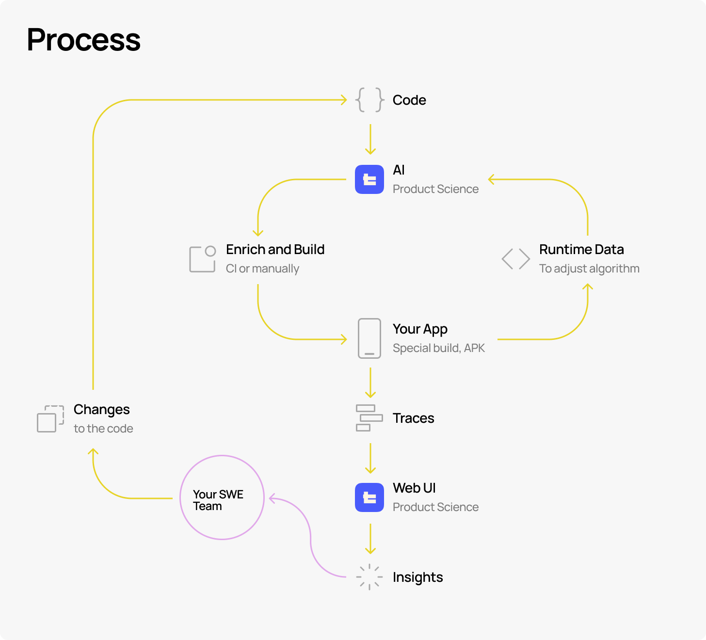

# Getting started
_________________

## Mobile App Performance Optimization – what is it?
Mobile app performance optimization refers to identifying and improving code that plays a significant role in user experience – such as app start time, the loading time between screens, or time spent completing tasks. 

In the ever-growing app market, users can easily uninstall slow mobile apps and swiftly try the next app on the list. Mobile app performance doesn’t just refer to codebase quality and infrastructure – the user experience of the application’s responsiveness defines it.  

Along with that, Android and iOS storefronts incentivize app performance by giving lower search rankings to less-performant apps. App stores do this because more-performant apps provide a better UX and deliver more business value which we’ll see below.
_________________

## Why is Mobile App Performance Optimization Important?

**Brand Preference**

  [52% of users](https://econsultancy.com/17-stats-that-show-why-cx-is-so-important/) suggested they are less likely to interact with a brand after a poor mobile app experience

**Brand Reputation**

  [36% of users](https://techbeacon.com/sites/default/files/gated_asset/mobile-app-user-survey-failing-meet-user-expectations.pdf) who had experienced slow performance issues had a lower opinion of the company

**Customer Retention**

  [96% of users](https://techbeacon.com/sites/default/files/gated_asset/mobile-app-user-survey-failing-meet-user-expectations.pdf) say app performance – factors such as speed and responsiveness – matters when deciding whether to keep or uninstall an app

_________________

## What is PS Tool?
If you’re unfamiliar with the concept of tracing, performance analysis can initially seem overwhelming. Our PS tool will change the way you think about performance engineering. With our visualizations, you will effortlessly understand how every function relates to another and identify relevant code optimization opportunities. 

At Product Science (PS), we offer a set of tools for mobile app performance engineering that includes: 

* Dynamic automatic code instrumentation via AI-powered plugins added to the build process;
* PS multi-threaded code profiling tool highlights critical functions and frameworks that impact user experience, revealing the root cause of problems;
* PS Companion mobile app to record and upload traces from your mobile device.

By replacing manual instrumentation and embedding right into the build processes, we enable anyone to identify points of app causation of performance issues with clear visualization.

_________________

## Who is PS Tool for?
PS Tool empowers anyone who understand code to use our visualization tool powered by AI to find performance optimization insights.

_________________

## How does PS Tool work?
Start with instrumenting your app’s code with our PS Gradle plugin / Xcode Code Injector powered by AI which  only visualizes functions that impact your mobile app’s performance. 

PS Tool profiles and visualizes recorded (user) flow and our AI will then suggest execution paths –  the sequence of functions executed – that empower identification of performance opportunities.

* ‍[New to instrumentation? Learn what it is here](/essentials-steps/#instrumentation)

### How to see performance optimization insights, step by step:
1. Use our plugin during the build process to instrument your code

    * [Learn How To](/essentials-steps/#how-to-instrument)

2. Run the build on the target device

    * [Learn How To](/essentials-steps/#instrumentation)

3. Record the trace and video while the app runs and walk through a [flow](/dictionary/#user-flow) that you want to optimize performance for

    * [Learn How To](/essentials-steps/#recording)

4. Upload the recorded trace using our PS Companion App

    * [Learn How To](/essentials-steps/#uploading)

5. Visualize insights with PS Tool

    * [Learn How To](/working-with-ps-tool)

