# Working with PS Tool
‍
At Product Science, performance optimization starts with defining key [(user) flows](/dictionary/#user-flow) that bring the most value to users. We visualize your code that empowers you to capture optimization opportunities that impact user experiences. You can optimize how quickly the app starts up, how its processes perform, how smooth animation is, etc.
 
* ‍[Learn how to create user flows and upload traces in the Flow Library section](/working-with-ps-tool/#flow-library)

At the center of the PSTool Dashboard is the trace viewer which shows essential information, such as what functions were invoked, their duration, and execution paths. Visualizing execution paths here is critical because it allows you to see the sequence of functions and how they connect and highlight optimization opportunities.

* ‍[Learn how to work with traces in the Trace Viewer section](/working-with-ps-tool/#trace-viewer)

### Accessing the PS Tool

Visit [productscience.app](https://productscience.app/sign-in) and log in using your company email.

_________________

## Flow Library

Flow library organizes all traces by [(user) flow](/dictionary/#user-flow). This is where you can view, subscribe, manage and create [flows](/dictionary/#user-flow). Like a folder in a file system, each [flow](/dictionary/#user-flow) contains traces of user flows that your team records and optimizes. Use Flow Library to group traces by [flows](/dictionary/#user-flow) that make the most sense to you and your team. Add a description to communicate the context of the [flows](/dictionary/#user-flow).

### Open a trace in PS Tool

Flow Library > Select a flow card > Flow Table > right click any trace > click “open”

### Create new flow

1. In Flow Library > click “Create new flow”
  

2. Enter your flow name & description

_________________

## (User) Flow Screen

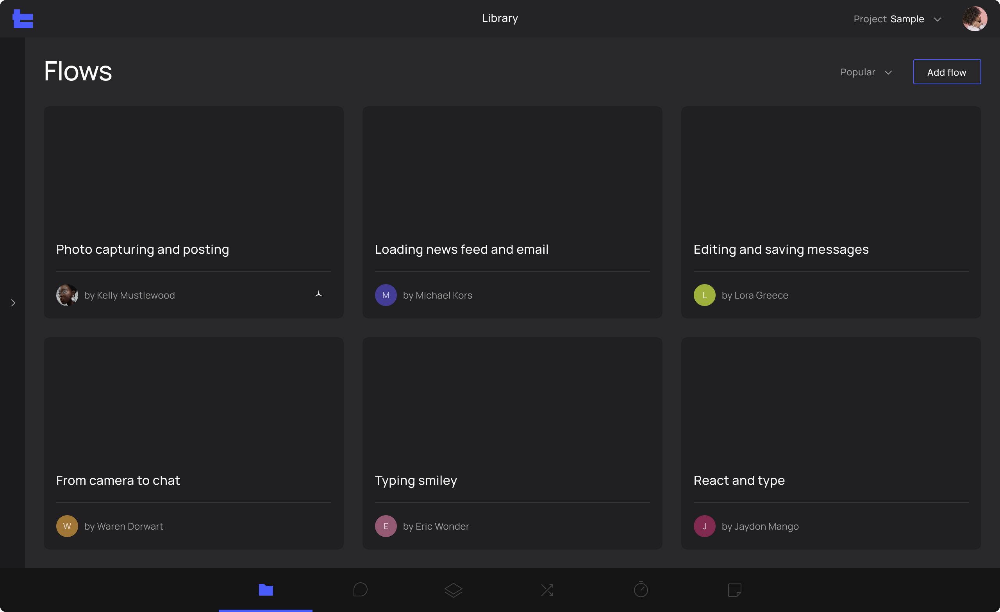

The Flow Screen is where you can find all the traces uploaded associated with a single [flow](/dictionary/#user-flow). This is where you can [add](#add-new-trace), [delete](#delete-trace), [edit](#edit-flow-description), and [assign](#assign-trace-to-another-flow) your trace. 

We encourage you to record more than one trace for every [flow](/dictionary/#user-flow). More recordings can increase the statistical significance of your “findings”. Specifically for flows containing asynchronous I/O operations like network requests, recording multiple traces can increase your confidence in locating patterns of performance issues within the trace.

### Add new trace

#### Via our PS Companion app

* ‍[Learn How To](/essentials-steps/#uploading)

#### Via manual upload

1. Click the “Add new trace” button on the Flow screen

2. Upload traces by dragging the trace or browse from computer
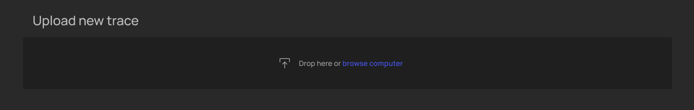

3. Once the trace is uploaded successfully, you shall see the message
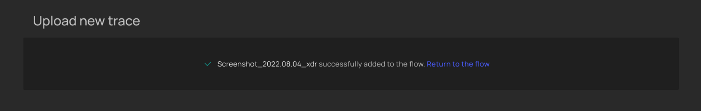

#### Via select from unassigned

Alternatively, you can use traces that were previously uploaded but not assigned.

1. Click on "Review and assign" button

2. Check the box for the trace you would like to assign
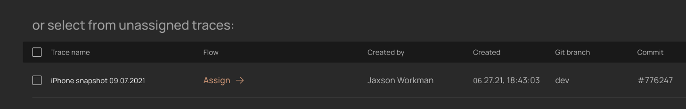

3. Select the flow you would like to flow to be assigned to
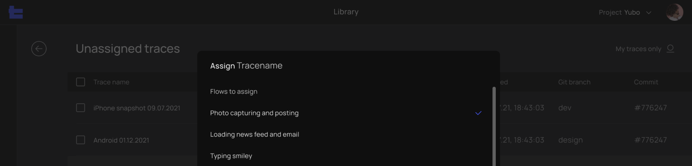

#### Delete flow
1. In Flow Library > hover over the bottom right corner of flow
2. Click on the "..." button on the flow card

#### Edit flow description
1. Flow Library > Flow card > Flow settings

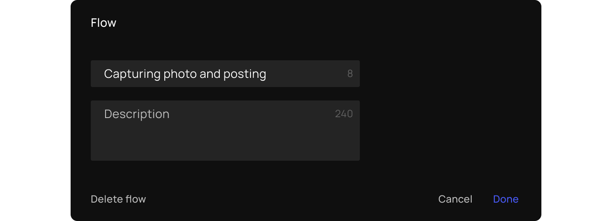

#### Assign trace to another flow
1. In the Flow screen

2. Click on the trace > menu will appear > click "Assign"

3. Select one or multiple flows you want to assign the trace to > Click "Done"

_________________

## Trace Viewer

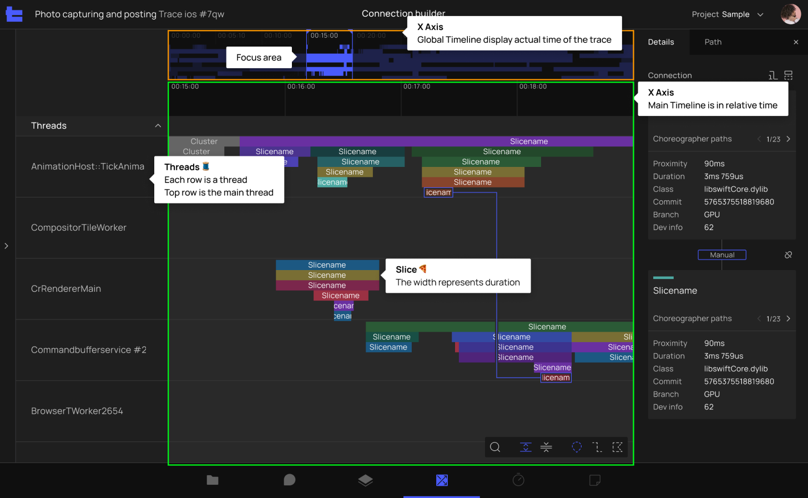

A trace is a time series snapshot of your app. Our dynamic, multi-threaded tracing tool captures and measures all functions executed during the recording. While millions of events and functions might be executed on the system level, our AI filters key functions that impact your user experience the most while filtering out all irrelevant information.

**Slices**

The width of the trace represents duration of the executed process while where it positions indicates the start time. A slice represents a single unit of work done by the CPU, and the width (X-Axis) of the slice represents the duration of the executed process and its position indicates the start time. Learn more

The nesting (Y-Axis) of slices represents the call stack of a specific function.
In the image below, you can see how function B ( Slice B ) was called by function A (slice A)

* ‍[Learn how to](#slices)
‍

**Execution Path**

The execution path is the most helpful tool to determine where the delays are coming from. It shows which function call stacks  are called by which function call stacks, so you can quickly see not just how individual functions are related but by how groupings of functions are related, creating an elevated perspective of the code which makes it easier to zoom-out and quickly find the root cause of a problem.

* ‍[Learn how to](#execution-paths)

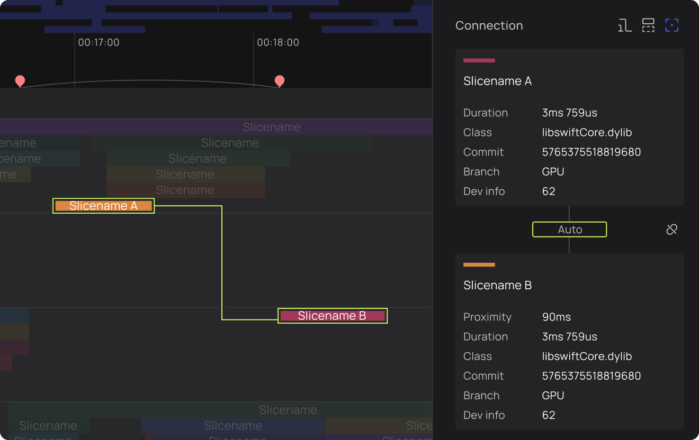

#### Navigate main timeline

The center of the dashboard is what we call the main timeline of your user flow. It tells you about your different processes at a specific time. Though you won’t be able to view the details of slices here, you can see when your app is fully loaded and when it’s idling.

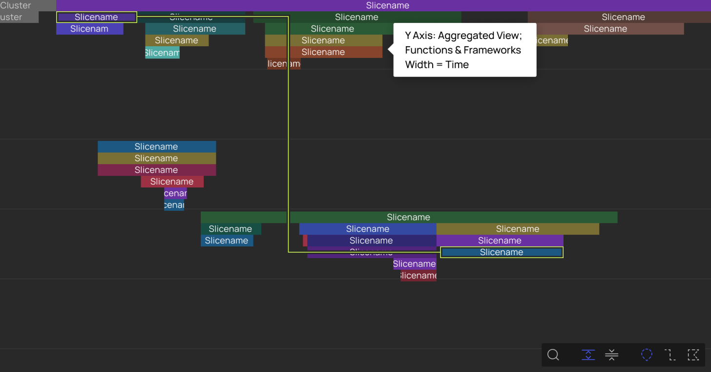

To navigate the main timeline view, in addition to your trackpad, you can use the following key commands:
W - Zoom in
S - Zoom out
A - Move left
D - Move right

#### Navigate aggregation view (global timeline)

In the timeline near the top of the dashboard, you’ll see what looks like a measuring tape. 

* Numbers at the top indicate where you are based on the trace's timeline. 
* Numbers at the bottom measure the distance between functions on the trace or the time it takes for a function to execute.

You can adjust the focus area by dragging the blue limit handles located on the edges.

#### Slices

The visual representation of a code’s function/process. The length of the slice indicates how long it takes that process to execute.

The width of the slice represents the duration of the executed process and its position indicates the start time.

### Property Panel

The property panel allows you and your contributors to:

* View and copy details of the slices including slice name, thread name, slice ID, object ID, start time, and duration.
* [Create manual connections](#create-manual-connections)
* Find [execution path](#execution-paths)-related tools such as:
‍
  
  Show/hide all paths

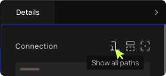

  Sort threads by execution path

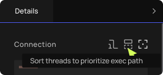

  Dim slices outside of execution path

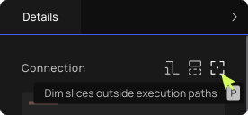

* Review connections
* Customize [flags](#place-a-flag)

#### Execution Paths

1. Click on any slice and our system will automatically check any [connections](#create-manual-connections) linked to this slice. In other words, we highlight actions and processes that occurred resulting in the slice you chose. 
2. Once an execution path – a one-directional linked list of slices –  is found, you should see lines like the example below. For example, if Slice A calls Slice B, they will be connected.

The green path is what we refer to as the main execution path; it usually contains more slices than the other lines and gives you a better image of where the delays are located.
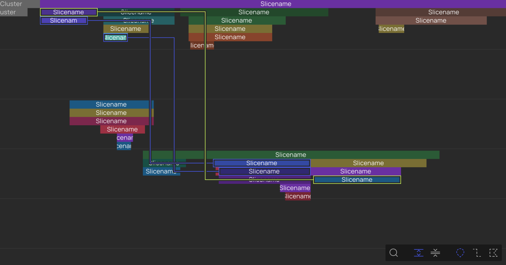

3.Open property panel

4.Click the button below to hide/show other non-main execution paths

Example of clicking the filtering button to only show the main execution path

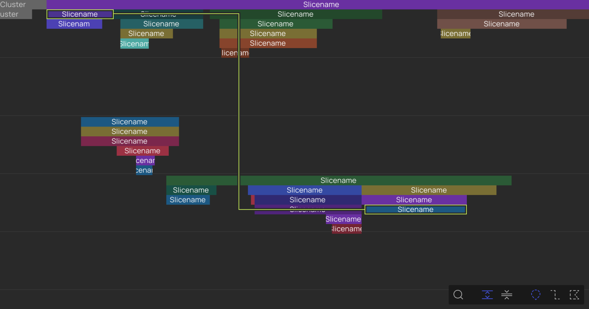

5.View slice and connection details on the property panel (right side)

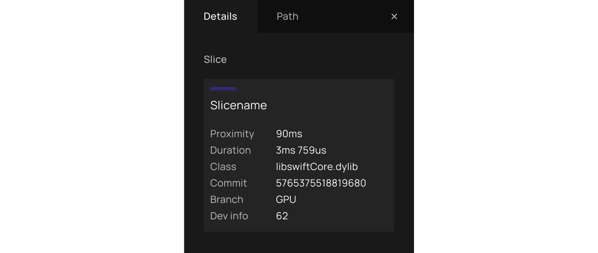

#### Create manual connections

1. Click on a slice > Slice details show in the [property panel](#property-panel).

2. Click the "create connection" icon next to the slice or press C while the slice is selected.

 
3. Slices that cannot be connected to the slice clicked are dimmed.
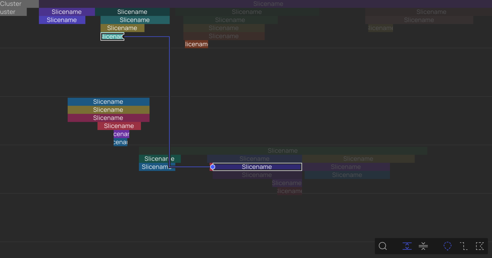

4. Repeat step 2 to connect more slices.

#### Working with Video

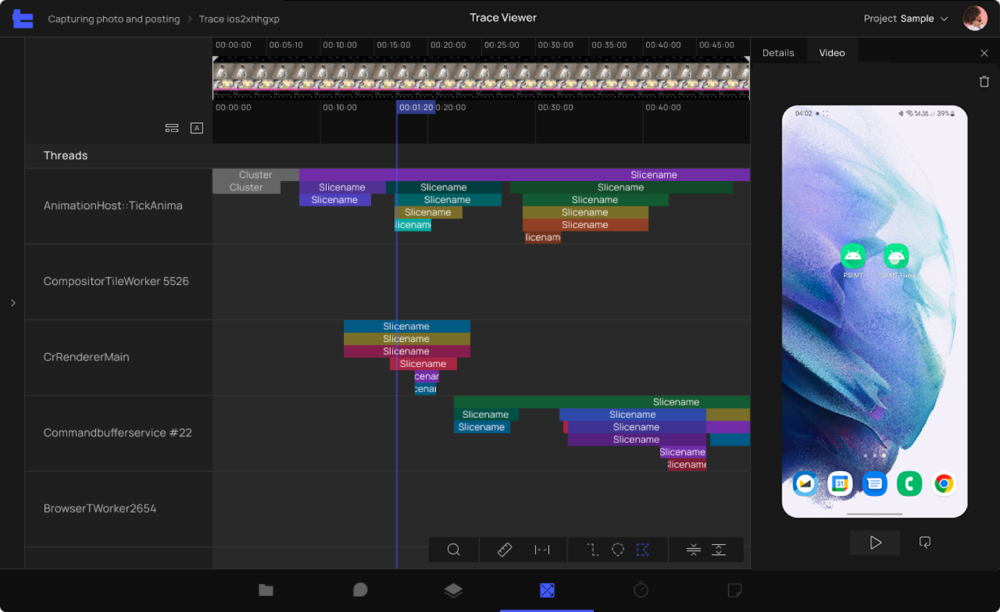

In the Trace Viewer, you can find the **Video** panel next to the **Details** panel where you can view, [upload](/essentials-steps/#upload-screen-recordings), [play](#play-pause-video), [pause](#play-pause-video) and [remove](/essentials-steps/#delete-screen-recordings) screen recording of your traces. 

##### Switch between Aggregated and Video views 
**Option 1: Use the View Toggle [Soon to be released]**

* Trace Viewer > Left of the global / aggregated view timeline;
* Click on the button toggle to switch between aggregated or video views.

{ style="display: block; margin: 0 auto" }

**Option 2: Switch between Panels**

* Click on the **Video** panel > Bring you to the video view where the video frames replace the global timeline.
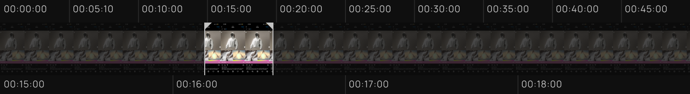

* Click on the **Details** panel >  Bring you back to the default, aggregated view of the trace.
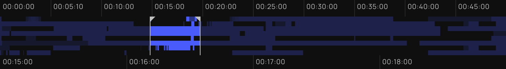

##### Set Focus Area
**On the Main Timeline**

* Trace Viewer > [Enable video view](#working-with-video).
* Shift-drag the beginning or end of the focus area - it will adjust the beginning and the end of what you see on the main timeline.

* The focus area selected will automatically sync with the Video panel.

##### Current Time Indicator

Current Time Indicator (the purple flag) highlights the current position of the screen recording video on the trace timeline. It is like a vertical ruler that enables you to see how all the threads and slices the current time indicator touches are associated with the video frames shown on the video panel.

**Previewer**

Hover the top part of the global timeline and you will see the Current Time Indicator Previewer (white flag) appears. Move the previewer along the timeline and you can preview the video on the video panel.

If you click while you’re in preview mode - the current time indicator (purple flag) will move to the clicked position. If you move your cursor out of the global timeline, the video preview in the video panel changes to the current-time indicator position. 

**Important Tips**

* You can only set current time indicators within the focus area limits.

**Play/ Pause Video**

* Open the Video panel.
* Press 'play' button at the bottom of the video.

  { style="display: block; margin: 0 auto" }

* Screen recording and the current time indicator on the main timeline play in a loop within the limits of the focus area. 
* Press 'pause' button at the bottom of the video to pause both the video and current time indicator.

  { style="display: block; margin: 0 auto" }

##### Loop Video

To make the video repeat continuously

* For the video to loop from beginning to the end of the video - press

{ style="display: block; margin: 0 auto" }

* For the video to loop within the focus area - press the same button that has now turned blue.

{ style="display: block; margin: 0 auto" }

* To turn the loop feature off - press the button again.

{ style="display: block; margin: 0 auto" }

#### Use Search

1. Search for any framework and function using the search box at the bottom right

2. All related instances should be immediately highlighted (while all the other unrelated functions should be dimmed). 
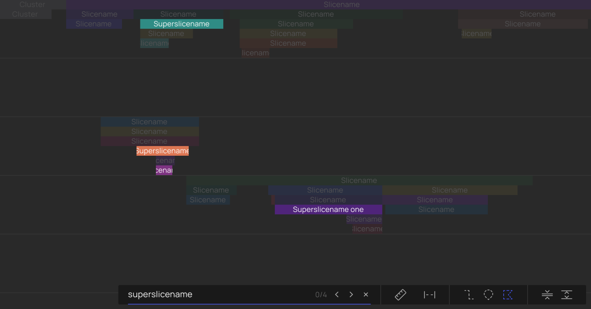

3. Use arrows inside the search box to navigate among the search results

4. Press Esc or click "x" to exist search

#### Measure Time
To understand the duration of one function to another, you can use our measurement tool by holding **shift + click**.

#### Threads
Smallest executable task of the system. PS multi-threaded code profiling tool highlights critical functions and frameworks that impact user experience, revealing the root cause of problems.
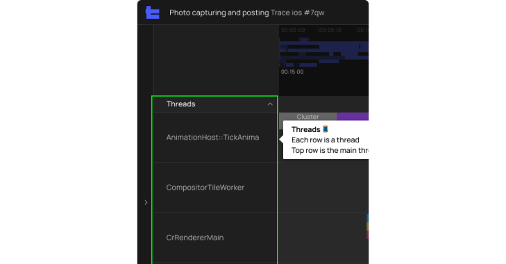

#### Pin Threads
Click the star to the right of a thread name to pin the thread to the top of the window for easy comparison and reference.

#### Deprioritize Threads
Click the downward button to the left of a thread to pin the thread at the bottom of the window if you find that particular thread not as informative.

#### Place a flag
We recommend placing flags at the beginning and the end of a [flow](/dictionary/#user-flow). You also get to choose colors of placed flags, which is helpful when you need to keep track of different information.

1. Hover over the timeline, and you’ll see a gray flag.
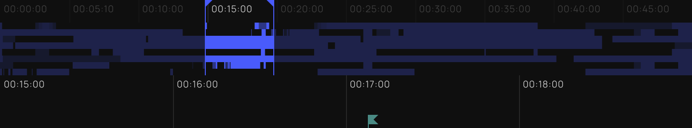

2. Click on the timeline to place the flag.
3. Our tool will randomly pick a color for your flag, which you can manually edit on the right-hand side of the screen. This is also where you can add labels to your flag.

**Pro tip**: You can also use the label field for quick notes. Simply click on the “label”, press shift + enter and start typing. That way, the notes you typed won’t show in the timeline, but you can use the notes for future reference.

#### Delete a Flag
When a flag is no longer relevant, you can remove it by:

1. Clicking on the flag
2. Clicking on the "trash can" button when the flag details menu is shown on the right; or pressing "Del" on your keyboard.

_________________

## Admin Screen
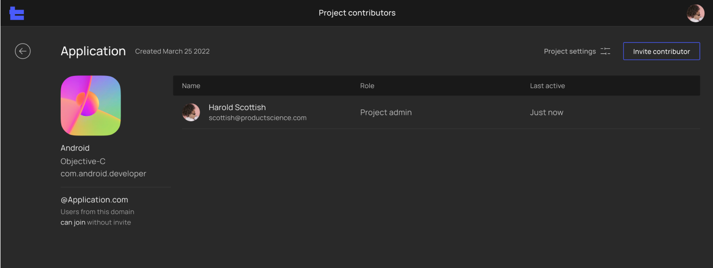

#### Team
Team is the representation of a company. This is where you can create projects (per single app and operation system) that contain all [flows](/dictionary/#user-flow) and traces.

* ‍[Learn more about what you can do as a Team Admin.](#team-admin)

#### Project
Project is where you can create different flows and traces for a single app. You can join and contribute via an invitation from the team's or project’s admin.

* ‍[Learn more about what you can do as a Project Admin.](#project-admin)

#### Collaborating
**Roles and Permissions**

Every team member can have team-level permissions that determine their default access to projects.

#### Team Admin
**Update Project Icons and Details**

1. In Project > click "project settings"

2. Hover over the thumbnail > click on the image icon.
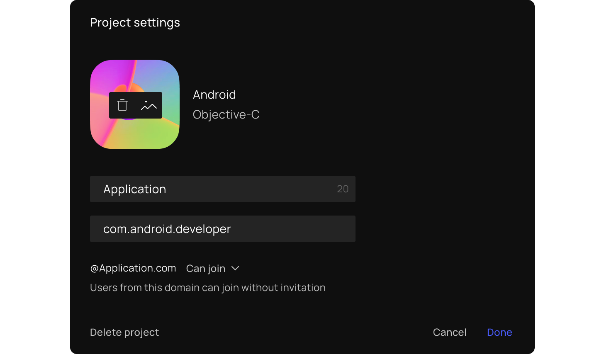

##### Remove a Project
1. In Project > click "project settings"

2. Click "delete project"

##### Update Team Member’s Role
1. In Team > click on "team contributors" to view the table.

2. Click and choose new role under the "Role" Column.
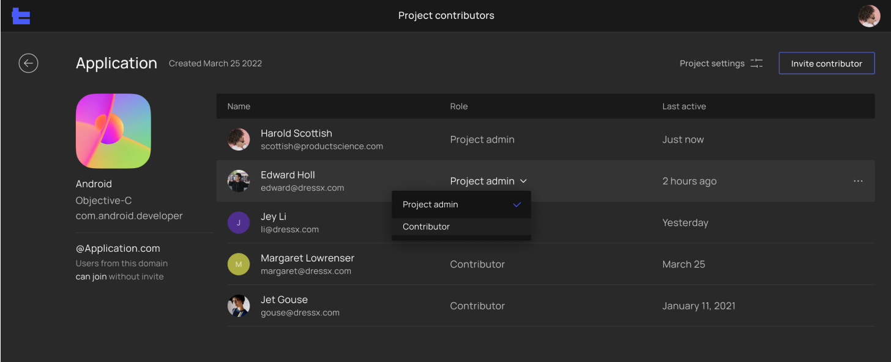

3. Click out to save

##### Resend Invitation Link
1. In Team> Team contributors > click on "team contributors" to view the table.

2. Click the ".." button on the right of the table > menu appears.
3. Click "resend invitation link".

##### Remove a Team Member
1. Project screen > click on "project contributors" to view the table.

2. Click the "..." button on the right  side of the table > menu will appear.
3. Click "delete account".

##### Update Email Domain
1. Home page > click "team settings"

2. Update your company email domain so that everyone with the specified email domain can log in.
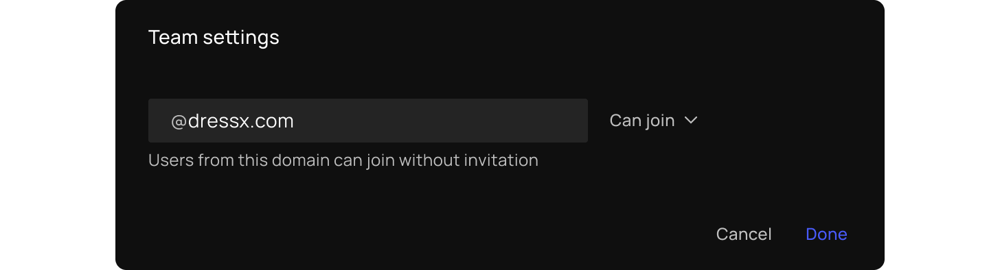

#### Project Admin
##### Update Team Member’s Role in Project
1. In Project > click on "project contributors" to view the table.

2. Click and choose a new role under the "Role" Column.

3. Click out to save

##### Remove Team Member
1. In Project > Project contributor > click on "project contributors" to view the table

2. Click the ".." button on the rightest of the table > menu appears
3. Click "delete account"

##### Invite New Team Member
1. In Project > Project contributor > click "invite contributor" on the top right corner.

2. Input the email and select the role.
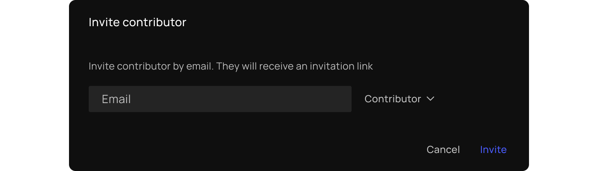

3. Click "Invite"

##### Resend Invitation Link
1. In Project > Project contributor > click on "project contributors": to view the table.

2. Click the ".." button on the far right side of the table of the table > menu will appear.
3. Click "resend invitation link".

